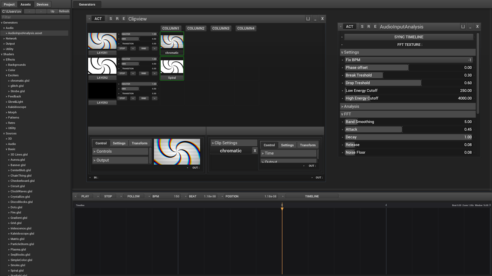

# Quick Links

Linux variant:

https://github.com/shizotech/shizoengine3_standalone_linux

Dev version:

https://github.com/shizotech/shizoengine3_dev

# VibeVJ - Agentic coding VJ software

If you want new features faster:

https://buymeacoffee.com/erikm



VibeVJ is a code-driven VJ (Visual Jockey) application for **live visual performances, immersive installations, and interactive experiences**. It is built around one core idea: *everything is a generator* — every visual, audio, network, and utility block is a self-contained, scriptable unit that the engine loads, wraps in its own window, and manages end-to-end.

## What it can do

- **Projection mapping with GLSL shaders** — map visuals to arbitrary surfaces, blend layers, and compose effects on the GPU.
- **Audio-reactive visuals** — live audio input is analyzed by generator assets and drives real-time reactive graphics (see `assets/Generators/Audio/AudioInputAnalysis.asset`).
- **Artnet / DMX light control** — send and receive Art-Net packets over Ethernet to drive DMX512 lighting fixtures (moving heads, pars, bars). Fixture definitions live under `assets/Fixtures/` and `assets/FixtureEffects/`.
- **Video input** — pull in external video via SPOUT2 sharing (`spout_receiver`).
- **Agentic / AI-driven interaction** — the program exposes `vibevj_*` tools so an AI agent can query state, control generators, and drive the show (see Agentic Interaction below).
- **Composable, user-designed UI** — views can be nested and composed by dragging/dropping one view into another (generatorview, clipview, clipstackview, singleview).
- **Built for installations of any kind** — interactive, immersive, and live performance setups.

## Getting Started

1. **Portable version** — the standalone build lives at `VibeVJ.exe` at the repo root. Just double-click it; no install, no dependencies.

2. **Editable dev version** — if you want to modify or extend the source, grab the development repo here:

   https://github.com/shizotech/shizoscript_dev

3. **Special key commands** (full list in `VibeVJ/SPECIAL_CONTROLS.MD`):

   - **Page Up / Page Down** — scale any view or the file browser (zoom in/out).
   - **E** — show or hide the header panel of the focused generator.
   - Per-generator window also has **ACT** (gate), **S** (save state), **R** (reload), **X** (close), **|_|** (big view), **_** (collapse).

## Project Structure

Top-level layout:

```
.
├── VibeVJ.exe            # Standalone portable executable
├── VibeVJ/              # Main program source (ShizoScript + GLSL + HLSL)
│   ├── __init__.shio    # Entry point
│   ├── assets/          # Visual & processing assets
│   │   ├── Shaders/     # GLSL shader assets (Effects, Sources, Utilities)
│   │   ├── Generators/  # Generator definitions by category
│   │   ├── Fixtures/    # DMX fixture JSON definitions (bars, moving heads, pars)
│   │   ├── FixtureEffects/
│   │   ├── LEDMapping/
│   │   ├── Textures/    # Image / texture assets
│   │   ├── Views/       # Composable UI view assets
│   │   ├── ASSET_GUIDE.MD
│   │   └── README.md
│   ├── engine/          # Core engine + generator wrapper
│   ├── src/             # Menu + layout UI
│   └── projects/        # Project state / configs
├── shizotech/           # ShizoScript standard library (REFERENCE ONLY — do not edit)
├── AGENT_README.MD
└── README.md
```

### Generator categories (`VibeVJ/assets/Generators/`)

- **Math** — `SineGenerator`, `TriangleWave`, `SquareWave`, `SawtoothWave`, `NoiseGenerator`, `LFOSynth`, `LFOClock` — signal / waveform sources.
- **Audio** — `AudioInputAnalysis` — live audio analysis for reactive visuals.
- **Network** — `artnet_receiver`, `artnet_sender` (with fixture presets under `presets/`), `spout_receiver` (SPOUT2 video in).
- **Output** — `LEDMapping` — drives LED / DMX output.
- **Utility** — `textbox`, `value_text`, `Chat`, `ColorSelector`, `XYPad`, `control4` — generic UI / value widgets.

### Shaders (`VibeVJ/assets/Shaders/`)

- **Effects/** — `Color` (ColorMatrix, HSVAdjust, HueRotate, colorize*, contrast_bright_sat), `Exciters` (Strobe, chromatic, glitch), `Feedback&Blur` (Ghosting), `Glow&Light` (Bloom, EdgeGlow, NeonGlow), `Kaleidoscope`, `Examples` (BasicColor/Feedback/Pattern/Time).
- **Sources/** — source / generator shaders.
- **Utilities/** — utility shader helpers.

Author new assets: see `VibeVJ/assets/ASSET_GUIDE.MD` and `VibeVJ/assets/Shaders/SHADER_GUIDE.MD`.

## Agentic / AI Interaction

VibeVJ is built to be driven by an AI agent:

- The engine exposes a set of **`vibevj_*` tools** — e.g. query generator state, set focus, run actions, dispatch values. An agent can inspect what's on screen, change parameters, stack effects, and control light fixtures without a human touching the mouse.
- The **AGENT_README.MD** files (at root and in `VibeVJ/`) are the canonical onboarding docs for any AI agent working in this repo.
- All interaction goes through the universal `generatoritem.shio` wrapper: each generator exposes `save_state` / `load_state`, a `dispatcher`, and an ACT gate, so an agent can deterministically read and write generator state.

## License & Notes

- Distributed under **Non-Commercial Software License v1.0** (see the PDF at the repo root).
- The `shizotech/` directory is the ShizoScript **standard library** — read-only reference. Do **not** edit it.
- `engine/assets/` and `engine/processes/` are engine-internal glue — do **not** change them.
